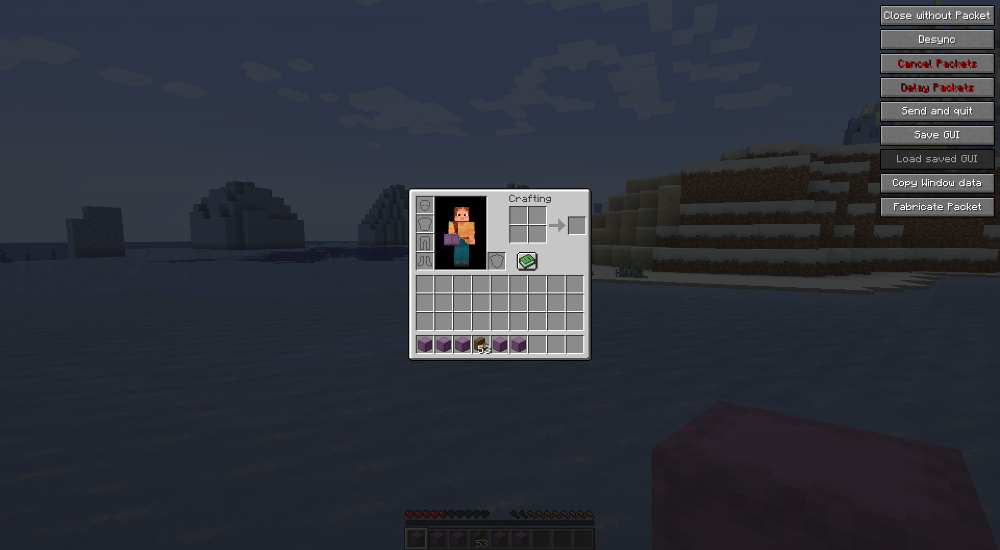
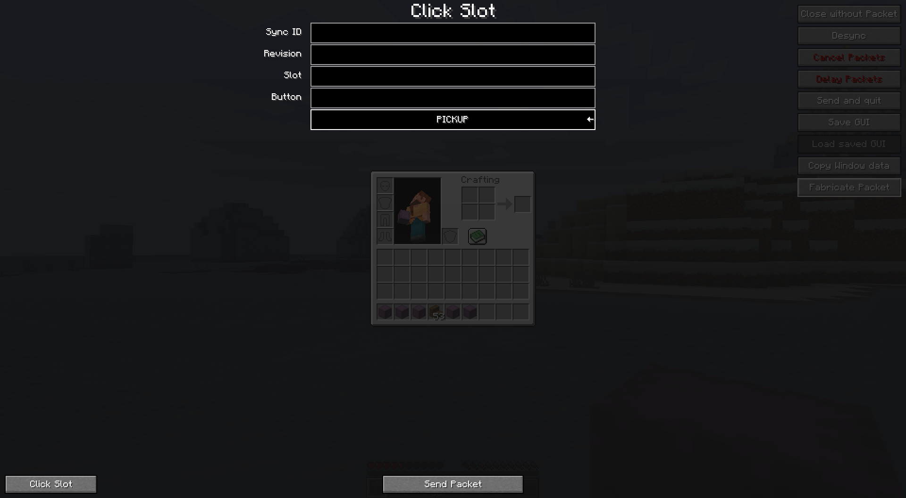

# UI-Utils-Reborn
Fabric mod for testing duplication exploits

## Contact
If you encounter any issues, please report them on the
[issue tracker](https://github.com/FlorianMichael/UI-Utils-Reborn/issues).  
If you just want to talk or need help with UI-Utils-Reborn feel free to join my
[Discord](https://discord.gg/BwWhCHUKDf).

## Features

Cleaned up rewrite from https://github.com/Coderx-Gamer/ui-utils  
More Features:
- Multi-Language Support
- Better Design and Code-base
- AntiRespawn Fix
- Removed Restore Key and added new Button
- Recoded 

## Tutorial
You can type `$ui-utils-reborn` into the chat to disable/enable the GUI stuff

### Buttons:
- **Close without Packet** Closes your current Screen without sending a `CloseHandledScreenC2SPacket` to the server
- **Desync** Closes your current Screen on the server but keeps it open on the client
- **Send Packets** if enabled, `ClickSlotC2SPacket` and `ButtonClickC2SPacket` packets will be cancelled
- **Delay Packets** if enabled, `ClickSlotC2SPacket` and `ButtonClickC2SPacket` packets will be stored until you disable the feature, then all packets will be sent
- **Send and quit** will send all stored packets from **Delay Packets** sent and disconnect
- **Save GUI** Saves your current Screen, you can re-open this save point with **Load saved GUI**
- **Copy Sync-ID** Copies your current Screen Sync-ID (can be used for packet fabrication)
- **Copy Revision** Copies your current Screen Revision (can be used for packet fabrication)
- **Copy Title (Json)** Copies your current Screen Title in Json formatting (only native version)
- **Fabricate packet** Allows you to send custom `ClickSlotC2SPacket` and `ButtonClickC2SPacket` packets

